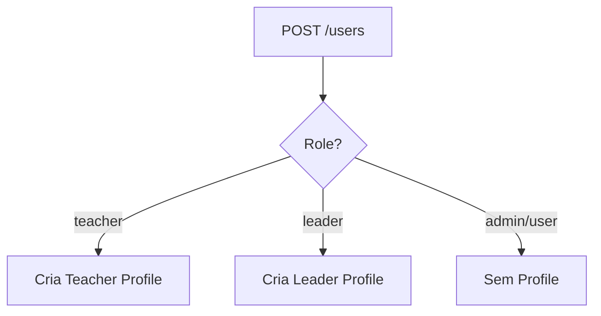
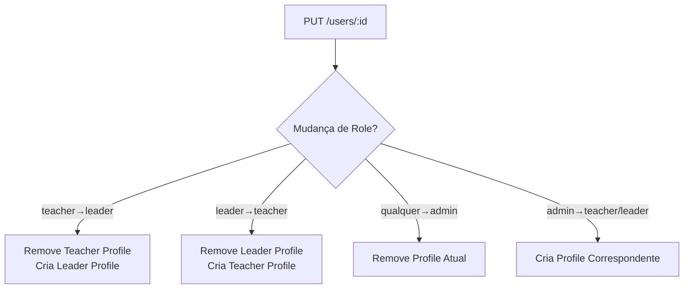
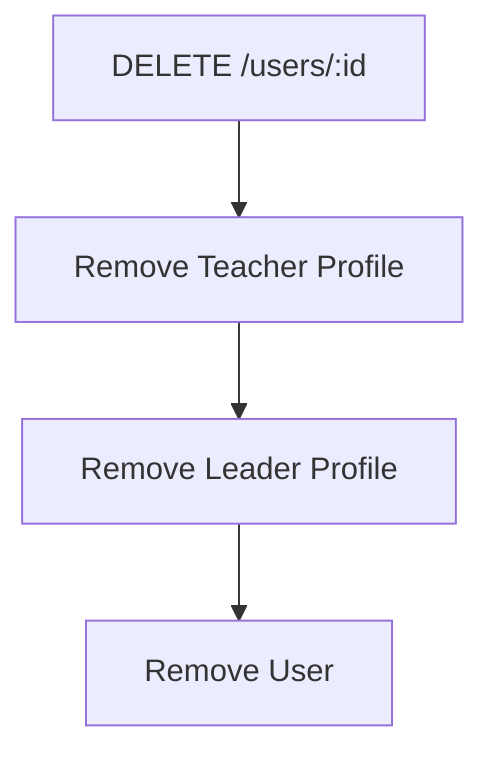

# 👥 Users Module - Documentação Completa

## 🎯 Visão Geral

O módulo **Users** é o orquestrador principal do sistema, responsável por gerenciar usuários e automaticamente criar/gerenciar os profiles de **Teacher** e **Leader** conforme o role do usuário.

### 🔑 Características Principais
- **CRUD Completo** de usuários
- **🎭 ORQUESTRAÇÃO AUTOMÁTICA** de Teacher/Leader profiles
- **Mudança de Roles** com migração automática de profiles
- **Ativação/Desativação** com criação/remoção de profiles
- **Filtros Avançados** e paginação
- **Validação Robusta** de dados
- **Controle de Acesso** por roles

### 🎭 Sistema de Orquestração

O módulo Users implementa uma **orquestração inteligente** que gerencia automaticamente os profiles:

#### **Criação de Usuário:**
- ✅ Role `teacher` → Cria automaticamente `TeacherProfile`
- ✅ Role `leader` → Cria automaticamente `LeaderProfile`
- ✅ Role `admin` → Não cria profile específico

#### **Mudança de Role:**
- ✅ `teacher` → `leader` → Remove Teacher Profile, cria Leader Profile
- ✅ `leader` → `teacher` → Remove Leader Profile, cria Teacher Profile
- ✅ Qualquer role → `admin` → Remove todos os profiles

#### **Ativação/Desativação:**
- ✅ Ativar usuário `teacher` → Cria Teacher Profile
- ✅ Desativar usuário `teacher` → Remove Teacher Profile
- ✅ Ativar usuário `leader` → Cria Leader Profile
- ✅ Desativar usuário `leader` → Remove Leader Profile

#### **⚠️ IMPORTANTE - Controle de Visibilidade:**
- ✅ **Usuários com `active = false` NÃO aparecem** nas listagens de Teacher Profiles
- ✅ **Usuários com `active = false` NÃO aparecem** nas listagens de Leader Profiles
- ✅ **Filtro automático**: `teacher_user.active = true` e `leader_user.active = true`
- ✅ **Controle total**: Apenas o admin pode ativar/desativar usuários

#### **Exclusão:**
- ✅ Remove Teacher Profile (se existir)
- ✅ Remove Leader Profile (se existir)
- ✅ Remove User Entity
- ✅ Mantém integridade referencial

## 📋 Endpoints Disponíveis

### 1. **GET /users** - Listagem Paginada
Lista usuários com filtros, paginação e ordenação.

**Query Parameters:**
- `page` (number): Número da página (padrão: 1)
- `limit` (number): Itens por página (padrão: 12, máx: 100)
- `q` (string): Termo de busca (nome, email, telefone, role)
- `role` (string): Filtro por role (`teacher`, `leader`, `admin`, `user`)
- `active` (boolean): Filtro por status ativo
- `completed` (boolean): Filtro por status completado
- `sort` (string): Campo de ordenação (`name`, `email`, `phone`, `role`, `createdAt`, `updatedAt`)
- `order` (string): Direção da ordenação (`ASC`, `DESC`)

**Exemplo de Request:**
```http
GET /users?page=1&limit=10&role=teacher&active=true&sort=name&order=ASC
```

**Exemplo de Response:**
```json
{
  "items": [
    {
      "id": "uuid-user",
      "name": "João Silva",
      "email": "joao@example.com",
      "phone": "+5511999999999",
      "role": "teacher",
      "active": true,
      "completed": true,
      "commonUser": true,
      "createdAt": "2025-09-27T21:00:00.000Z",
      "updatedAt": "2025-09-27T21:30:00.000Z"
    }
  ],
  "meta": {
    "page": 1,
    "limit": 12,
    "total": 50,
    "totalPages": 5,
    "sort": "updatedAt",
    "order": "DESC"
  }
}
```

### 2. **GET /users/:id** - Buscar por ID
Busca um usuário específico pelo ID.

**Parâmetros:**
- `id` (UUID): ID do usuário

**Exemplo de Request:**
```http
GET /users/123e4567-e89b-12d3-a456-426614174000
```

**Exemplo de Response:**
```json
{
  "id": "123e4567-e89b-12d3-a456-426614174000",
  "name": "João Silva",
  "email": "joao@example.com",
  "phone": "+5511999999999",
  "role": "teacher",
  "active": true,
  "completed": true,
  "commonUser": true,
  "createdAt": "2025-09-27T21:00:00.000Z",
  "updatedAt": "2025-09-27T21:30:00.000Z"
}
```

### 3. **POST /users** - Criar Usuário
Cria um novo usuário e automaticamente cria o profile correspondente.

**Body (JSON):**
```json
{
  "name": "João Silva",
  "email": "joao@example.com",
  "password": "password123",
  "phone": "+5511999999999",
  "role": "teacher",
  "active": true,
  "completed": false,
  "commonUser": true
}
```

**Campos Obrigatórios:**
- `name` (string, min: 2): Nome do usuário
- `email` (email): Email único do usuário
- `password` (string, min: 6): Senha do usuário
- `phone` (string): Telefone do usuário

**Campos Opcionais:**
- `role` (enum): Role do usuário (`teacher`, `leader`, `admin`, `user`)
- `active` (boolean): Status ativo (padrão: false)
- `completed` (boolean): Status completado (padrão: false)
- `commonUser` (boolean): Usuário comum (padrão: true)

**Orquestração Automática:**
- Se `role = "teacher"` → Cria automaticamente **Teacher Profile**
- Se `role = "leader"` → Cria automaticamente **Leader Profile**
- Se `role = "admin"` → Não cria profile específico

**Exemplo de Response:**
```json
{
  "id": "uuid-user",
  "name": "João Silva",
  "email": "joao@example.com",
  "phone": "+5511999999999",
  "role": "teacher",
  "active": true,
  "completed": false,
  "commonUser": true,
  "createdAt": "2025-09-27T21:00:00.000Z",
  "updatedAt": "2025-09-27T21:00:00.000Z"
}
```

### 4. **PUT /users/:id** - Atualizar Usuário
Atualiza um usuário existente com orquestração automática de profiles.

**Parâmetros:**
- `id` (UUID): ID do usuário

**Body (JSON):**
```json
{
  "name": "João Silva Atualizado",
  "phone": "+5511888888888",
  "role": "leader",
  "active": true,
  "completed": true
}
```

**Orquestração de Mudança de Role:**
- **teacher → leader**: Remove Teacher Profile, cria Leader Profile
- **leader → teacher**: Remove Leader Profile, cria Teacher Profile
- **teacher/leader → admin**: Remove profile específico
- **admin → teacher/leader**: Cria profile correspondente

**Exemplo de Response:**
```json
{
  "id": "uuid-user",
  "name": "João Silva Atualizado",
  "email": "joao@example.com",
  "phone": "+5511888888888",
  "role": "leader",
  "active": true,
  "completed": true,
  "commonUser": true,
  "createdAt": "2025-09-27T21:00:00.000Z",
  "updatedAt": "2025-09-27T21:45:00.000Z"
}
```

### 5. **DELETE /users/:id** - Deletar Usuário
Remove um usuário e seus profiles associados.

**Parâmetros:**
- `id` (UUID): ID do usuário

**Orquestração de Exclusão:**
- Remove automaticamente **Teacher Profile** (se existir)
- Remove automaticamente **Leader Profile** (se existir)
- Remove o usuário

**Exemplo de Response:**
```json
{
  "message": "Usuário removido com sucesso"
}
```

## 🎭 Exemplos de Orquestração

### **Cenário 1: Criar Teacher**
```http
POST /users
{
  "name": "Professor João",
  "email": "joao@example.com",
  "password": "password123",
  "phone": "+5511999999999",
  "role": "teacher",
  "active": true
}
```
**Resultado**: Usuário criado + Teacher Profile criado automaticamente

### **Cenário 2: Mudar Teacher para Leader**
```http
PUT /users/uuid-user
{
  "role": "leader",
  "active": true
}
```
**Resultado**: Teacher Profile removido + Leader Profile criado automaticamente

### **Cenário 3: Desativar Usuário**
```http
PUT /users/uuid-user
{
  "active": false
}
```
**Resultado**: Profile (Teacher/Leader) removido automaticamente

### **Cenário 4: Reativar Usuário**
```http
PUT /users/uuid-user
{
  "active": true
}
```
**Resultado**: Profile recriado automaticamente baseado no role

## 🔐 Autenticação e Autorização

### Requisitos de Acesso
- **Autenticação**: JWT Token obrigatório
- **Autorização**: Apenas usuários com role `admin`
- **Guards**: `JwtAuthGuard` + `AdminRoleGuard`

### Headers Obrigatórios
```http
Authorization: Bearer <jwt_token>
Content-Type: application/json
```

## 📊 Estrutura de Dados

### UserEntity
```typescript
{
  id: string;                    // UUID único
  name: string;                  // Nome do usuário
  email: string;                 // Email único
  password: string;              // Senha hasheada
  phone: string;                 // Telefone
  role: UserRole;               // Role do usuário
  active: boolean;              // Status ativo
  completed: boolean;           // Status completado
  commonUser: boolean;          // Usuário comum
  refreshToken: string | null;  // Token de refresh
  createdAt: Date;              // Data de criação
  updatedAt: Date;              // Data de atualização
  teacherProfile?: TeacherProfileEntity;  // Profile de professor
  leaderProfile?: LeaderProfileEntity;    // Profile de líder
}
```

### UserRole Enum
```typescript
enum UserRole {
  TEACHER = 'teacher',
  LEADER = 'leader', 
  ADMIN = 'admin',
  USER = 'user'
}
```

## 🎯 Orquestração de Profiles

### Criação Automática


### Mudança de Role


### Exclusão


## 🔍 Filtros e Buscas

### Filtros Disponíveis
- **Por Role**: `?role=teacher|leader|admin|user`
- **Por Status Ativo**: `?active=true|false`
- **Por Status Completado**: `?completed=true|false`
- **Busca por Termo**: `?q=termo` (busca em nome, email, telefone, role)

### Ordenação
- **Campos**: `name`, `email`, `phone`, `role`, `createdAt`, `updatedAt`
- **Direção**: `ASC` ou `DESC`
- **Padrão**: `updatedAt DESC`

### Exemplos de Uso
```http
# Buscar professores ativos
GET /users?role=teacher&active=true

# Buscar por nome
GET /users?q=João

# Ordenar por nome crescente
GET /users?sort=name&order=ASC

# Paginação
GET /users?page=2&limit=5
```

## ⚠️ Tratamento de Erros

### Códigos de Erro Comuns

#### 400 - Bad Request
```json
{
  "statusCode": 400,
  "message": [
    "name must be longer than or equal to 2 characters",
    "email must be an email",
    "password must be longer than or equal to 6 characters"
  ],
  "error": "Bad Request"
}
```

#### 401 - Unauthorized
```json
{
  "statusCode": 401,
  "message": "Unauthorized",
  "error": "Unauthorized"
}
```

#### 403 - Forbidden
```json
{
  "statusCode": 403,
  "message": "Access denied",
  "error": "Forbidden"
}
```

#### 404 - Not Found
```json
{
  "statusCode": 404,
  "message": "UserEntity not found",
  "error": "Not Found"
}
```

#### 409 - Conflict
```json
{
  "statusCode": 409,
  "message": "Email already exists",
  "error": "Conflict"
}
```

## 🧪 Casos de Teste

### Cenários de Criação
1. **Criar Teacher**: Verifica se Teacher Profile é criado automaticamente
2. **Criar Leader**: Verifica se Leader Profile é criado automaticamente
3. **Criar Admin**: Verifica se nenhum profile específico é criado
4. **Email Duplicado**: Deve retornar erro 409

### Cenários de Atualização
1. **Mudança teacher → leader**: Remove Teacher Profile, cria Leader Profile
2. **Mudança leader → teacher**: Remove Leader Profile, cria Teacher Profile
3. **Desativar usuário**: Remove profiles automaticamente
4. **Ativar usuário**: Recria profiles automaticamente

### Cenários de Exclusão
1. **Excluir teacher**: Remove Teacher Profile e usuário
2. **Excluir leader**: Remove Leader Profile e usuário
3. **Usuário inexistente**: Retorna erro 404

## 📈 Performance e Limitações

### Limitações
- **Máximo de itens por página**: 100
- **Padrão de itens por página**: 12
- **Timeout de requisições**: 30 segundos

### Otimizações
- **Paginação**: Evita carregamento de muitos dados
- **Índices**: Email e ID são indexados
- **Lazy Loading**: Profiles são carregados sob demanda
- **Caching**: Tokens JWT são cacheados

## 🔧 Configuração e Dependências

### Dependências do Módulo
- `TeacherProfilesService`: Para orquestração de teacher profiles
- `LeaderProfilesService`: Para orquestração de leader profiles
- `bcryptjs`: Para hash de senhas
- `class-validator`: Para validação de DTOs
- `class-transformer`: Para transformação de dados

### Configuração de Segurança
- **Hash de Senhas**: bcrypt com salt rounds = 10
- **Validação de JWT**: Token obrigatório em todas as rotas
- **Controle de Acesso**: Apenas admins podem gerenciar usuários
- **Sanitização**: Dados são sanitizados antes do armazenamento

---

**Users Module - Sistema de Orfanato** 👥
